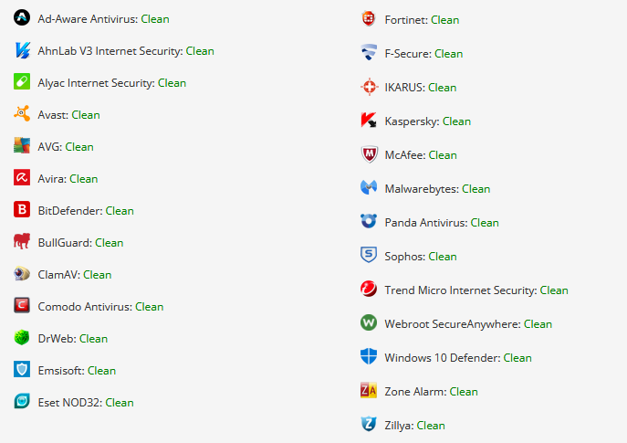

# CGPL - Yet, Another Packer/Loader 

After going through the OSEP certification material and other nice courses about Offensive C# around the web, I've decided that it was time to share something I wrote. 
CGPL (*naming convention of my tools is annoying, I know*) is a packer/loader written in C# with the following feature (*planning to make this list bit longer in the future*): 

* My very own **GetProcAddress** (*parsing PE headers is such a joy*) and **GetModuleHandle** (*decided to go for CreateToolhelp32Snapshot*) implementation to dinamically fetch the address of the Win32 API I wanted to use 
* **AES encryption** with a **SHA256 derived key** (*must admit got inspiration from some APT guys*) for payload and Win32 api function names (*delegates might still drop suspicious strings around, but you can also change those names*)
* It does not dare to allocate a memory buffer which is READWRITEEXEC at the same time 
 

## Usage

Change the shellcode and compile (*platform target x64*), unless you just want to pop calc.exe up. 

```bash
winbo:~$msfvenom --platform windows --arch x64  -p windows/x64/exec CMD=calc.exe -f raw -o test.bin
winbo:~$cat test.bin | base64 -w0
```

The AesOperation.cs class implements also the *encrypt* function, so an entra *Console.WriteLine(...)* is needed to see how your payload would look like all encrypted (*tutto cablato*). 
Also useful if you want to change the Win32 API I use with some other exotic ones. 

## Results

Che Bello (at least the last time I have tried):

